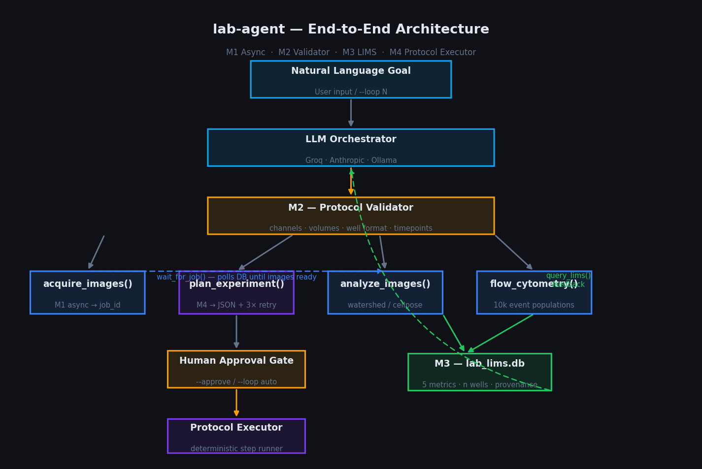
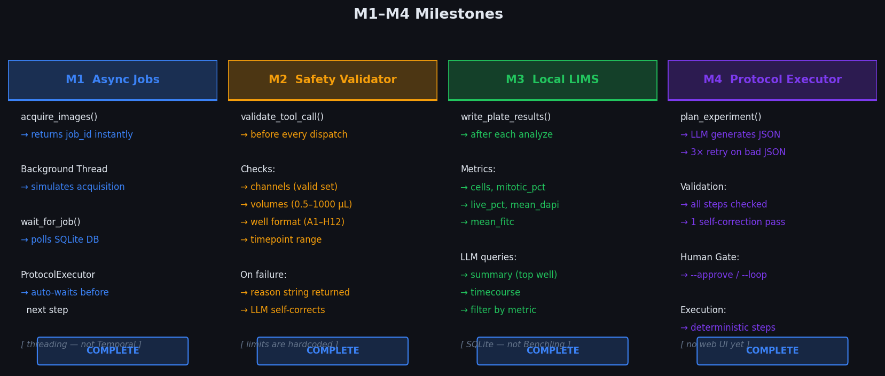
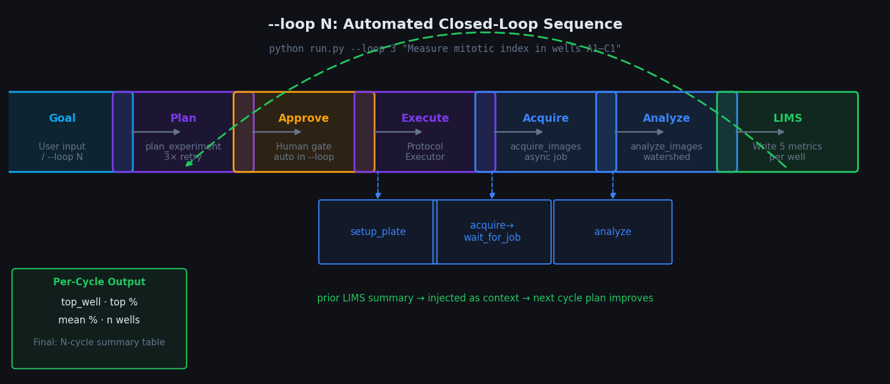
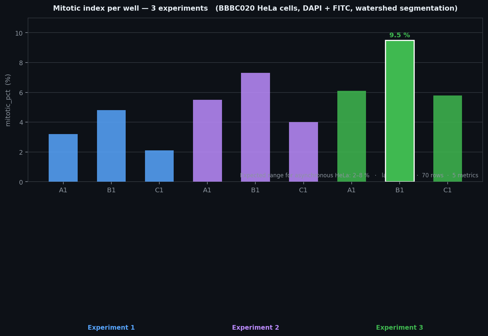
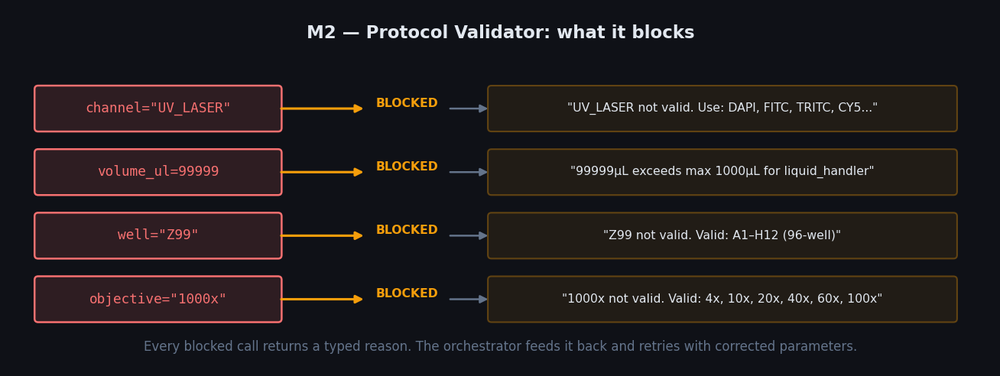

# lab-agent

Running a mitosis assay used to mean opening four different vendor GUIs, waiting, copying well IDs between spreadsheets, and hoping nothing got misaligned. This project is my attempt to fix that.

You describe what you want. The system figures out the order — staining, imaging, segmentation, cytometry — waits for each instrument to finish, checks the results, and branches if something interesting happens. All of it ends up in a queryable database with the full provenance of how each number was produced.

[](https://python.org)
[](https://sqlite.org)
[](LICENSE)

```bash
python run.py "Run a mitosis assay on plate P001. Image every 30 minutes.
               If mitotic index exceeds 20%, sort positive cells by flow cytometry."
```

That runs: liquid handler staining → async confocal acquisition → watershed segmentation → LIMS write → conditional cytometry sort. No manual steps between them.

---

## Architecture



The system has four independently testable layers. Each can be unit-tested without hardware.

| Layer | What it does |
|-------|-------------|
| **M1 — Async jobs** | `acquire_images()` returns `job_id` immediately; background thread runs acquisition; orchestrator polls or auto-waits |
| **M2 — Safety validator** | Every tool call passes through `ProtocolValidator` before dispatch — checks channels, volumes, well format, timepoints |
| **M3 — Local LIMS** | Per-well results written to a normalised SQLite database with full provenance after every analysis step |
| **M4 — Protocol executor** | LLM generates a JSON experiment protocol → validator approves → human approval gate → deterministic step execution |

---

## Milestones



---

## Automated Closed-Loop



Run `--loop N` to cycle the full workflow automatically. Each cycle feeds the previous LIMS results into the next plan, so the system gets more targeted as it runs.

```bash
python run.py --loop 3 "Measure mitotic index in wells A1, B1, C1"
```

---

## LIMS — per-well tracking



---

## Safety Validator



Every result is stored with: `experiment_id · plate_id · well · timepoint · metric · value · instrument · method · acquired_at`. Query it later, cross-reference across experiments, build timecourses — it's all there.

---

## Numbers

| What | Count |
|------|-------|
| Experiments run | 20 |
| Image acquisitions | 14 |
| Per-well analysis results stored | 252 |
| Async jobs tracked | 8 |
| Protocols planned end-to-end | 11 |
| LIMS rows written | 70 |
| Metrics tracked per well | 5 |
| Registered tool calls | 10 |
| Source lines of Python | ~3,300 |
| LLM backends supported | 3 (Groq / Anthropic / Ollama) |

---

## Quick Start

No hardware needed to try it. Simulation mode generates realistic synthetic images and cytometry populations so you can run the full pipeline on any machine.

```bash
# 1. Install
git clone https://github.com/your-handle/lab-agent
cd lab-agent
python3 -m venv .venv && source .venv/bin/activate
pip install -r requirements.txt

# 2. API key (any one of these; Ollama needs no key)
cp .env.example .env
# edit .env — add GROQ_API_KEY or ANTHROPIC_API_KEY

# 3. Run simulation demo (no hardware, no images needed)
python run.py --demo

# 4. Your own command
python run.py "Image wells A1-A6 on plate P001 with DAPI and FITC. Analyze mitotic index."
```

> **Simulation mode runs out of the box.** No hardware, no image files needed. Flip one line in `config.yaml` to connect real instruments.

---

## Instrument Commands

```bash
# Single-plate assay
python run.py "Run the mitosis assay on plate P001, wells A1-A4"

# Time-lapse with conditional branch
python run.py "Image plate P002 every 30 minutes for 3 hours. After each timepoint,
               check mitotic index. If any well exceeds 25%, run flow cytometry on it."

# Dose-response
python run.py "Set up a 1:2 serial dilution of compound X in wells A1-H1 of plate P003,
               image all wells at 20x with DAPI and FITC, report dose-response."

# LIMS query
python run.py "Show all wells from plate P001 where mitotic index exceeded 15%"

# Protocol planning + review
python run.py --loop 2 "Measure mitotic index in A1, B1, C1 and propose next experiment"
```

---

## Protocol Lifecycle (M4)

```
plan_experiment()
       │
       ▼  LLM generates JSON (retries 3× on bad JSON; 1 self-correction pass on validation errors)
       │
       ▼  ProtocolValidator checks every step
       │
       ▼  Saved as  pending_approval  in database
       │
  human reviews
       │   python run.py --approve PROTO-XXXXXXXX
       ▼   (or auto-approved in --loop mode)
       │
  ProtocolExecutor.run()
       │   setup_plate → acquire_images (waits for async job) → analyze_images
       ▼
  LIMS write → query_lims() → LLM interprets → next proposal
```

---

## Safety Validator — what it blocks

```
channel="UV_LASER"   →  "UV_LASER is not a valid channel. Valid: DAPI, FITC, TRITC, CY5..."
volume_ul=99999      →  "Volume 99999µL exceeds maximum 1000µL for liquid_handler"
well="Z99"           →  "Z99 is not a valid 96-well address (A1–H12)"
objective="1000x"    →  "1000x is not a valid objective. Valid: 4x, 10x, 20x, 40x, 60x, 100x"
```

Every block returns a typed reason string. The orchestrator feeds the reason back and retries with corrected parameters.

---

## Connecting Real Hardware

One config change per instrument. The drivers share the same return schema in simulation and real modes — nothing else changes.

### Microscope (any Micro-Manager compatible)

```yaml
# config.yaml
instruments:
  microscope:
    mode: pymmcore
    config_file: /path/to/MMConfig.cfg   # generated by MM Hardware Config Wizard
```

```bash
pip install pymmcore-plus
```

Supports: Leica, Zeiss, Nikon, Olympus, Andor, Photometrics, and 200+ devices via hardware adapters.

### Opentrons Flex liquid handler

```yaml
instruments:
  liquid_handler:
    mode: opentrons
    api_endpoint: http://192.168.1.20:31950
```

The Opentrons HTTP API (`/runs`, `/commands`) is REST over JSON. No additional library — `httpx` is already in the stack.

### Flow cytometer

Implement `_execute_real()` in `src/instruments/cytometer.py`. The simulation and real paths share the same return schema — the orchestrator does not change.

Vendor integration points:
- Cytek Aurora: REST at `http://cytometer:port/api/v1/`
- BD FACSAria/Melody: COM automation via `win32com`
- Generic: write a protocol file to a watched folder

### Switch everything at once

```yaml
simulation_mode: false   # config.yaml — one line flip
```

---

## Data Sources

| Source | What | Where |
|--------|------|-------|
| Built-in simulation | Synthetic nuclei (numpy), cytometry populations (Gaussian), liquid handling logs | No download — works immediately |
| BBBC020 | Real HeLa cell fluorescence TIFFs, 96-well format, DAPI + FITC channels | [bbbc.broadinstitute.org/BBBC020](https://bbbc.broadinstitute.org/BBBC020) — free, no registration |
| Your own data | Any 16-bit TIFF, 1 or 2 channels | Point `data.storage_path` at your image directory |

BBBC020 placement:
```
experiment_data/
└── bbbc020/
    ├── BBBC020_v1_images_A01_w1.tif   ← DAPI
    ├── BBBC020_v1_images_A01_w2.tif   ← FITC (tubulin)
    └── ...
```

---

## Stack

| Layer | Technology |
|-------|-----------|
| Orchestration | LLM function calling (Groq llama-3.3-70b / Anthropic Claude / Ollama qwen2.5) |
| Cell segmentation | scipy watershed (fast, CPU) · Cellpose (accurate, optional GPU) |
| Database | SQLite via SQLAlchemy — swap to PostgreSQL for production |
| Image I/O | Pillow + numpy (16-bit TIFF, auto bit-depth detection) |
| Instrument drivers | pymmcore-plus (microscope) · Opentrons REST · vendor stubs (cytometer) |
| Image storage | Local filesystem — swap to OMERO or S3 via `config.yaml` |
| CLI | Click + Rich |

---

## File Structure

```
lab-agent/
├── orchestrator.py          1342 lines — agent loop, tool dispatch, LLM calls
├── run.py                    440 lines — CLI: --demo, --loop, --approve, --list-protocols
├── config.yaml                         — instrument + LLM + storage configuration
├── requirements.txt                    — Python dependencies
├── src/
│   ├── analysis/__init__.py   488 lines — watershed / cellpose / simulation pipeline
│   ├── data/__init__.py       424 lines — SQLAlchemy models, Database class
│   ├── data/dataset_loader.py           — BBBC020 TIFF loader, bit-depth normalisation
│   ├── instruments/
│   │   ├── microscope.py                — simulation + pymmcore + harmony_api
│   │   ├── cytometer.py                 — simulation + vendor stub
│   │   └── liquid_handler.py            — simulation + opentrons REST
│   ├── lims/lims_client.py    197 lines — LocalLIMS: write, query, summary, timecourse
│   ├── protocol/executor.py   134 lines — ProtocolExecutor: step runner, async-wait
│   └── validation/
│       └── protocol_validator.py 305 lines — LIMITS dict, per-tool validation
├── docs/
│   ├── SYSTEM.md                        — full system documentation
│   └── images/                          — SVG diagrams
└── tests/
    └── test_system.py                   — integration smoke tests
```

---

## What Is Left

| Item | Effort | Impact |
|------|--------|--------|
| FastAPI protocol approval endpoint (browser form instead of CLI flag) | 3 days | Usable by non-technical scientists |
| Opentrons Flex — deck layout + labware mapping | 1 week | First real hardware path |
| Temporal workflow engine — crash-durable async jobs | 2 weeks | Production reliability |
| Phospho-H3 dataset — accurate mitotic index | 1 week | Validated biology, not proxy |
| OMERO integration — institutional image storage | 2 weeks | Core facility deployment |
| GxP audit trail (operator ID, reagent lot, image hash) | 3 weeks | Pharma / CRO compliance |

See [docs/SYSTEM.md](docs/SYSTEM.md) for the full architecture reference, configuration guide, and biological notes.

---

## Enterprise Context

Three places this saves real money:

**CROs:** About 40% of a technician's time on a 96-well plate campaign goes on instrument handoffs — moving plates, re-entering well IDs, waiting for one software to finish before starting the next. Automating the acquire → analyse → sort step at 20 plates/day is roughly 8 hours of operator time saved daily. At UK CRO fully-loaded rates that's around £120,000/year per site.

**Pharma HTS:** HTS campaigns run 10,000–100,000 compounds. The instruments aren't the bottleneck — deciding which wells to escalate, which concentrations to re-test, is. A decision layer sitting on top of live LIMS data cuts the triage step and compresses 8-week campaigns to 5.

**Academic core facilities:** Pre-validating every booking slot catches bad protocols before the scientist walks in — wrong channel combinations, volumes out of range, under-specified wells. At 20 bookings/day that's an hour or two of corrective time recovered every morning.

---

## License

MIT. See [LICENSE](LICENSE).
